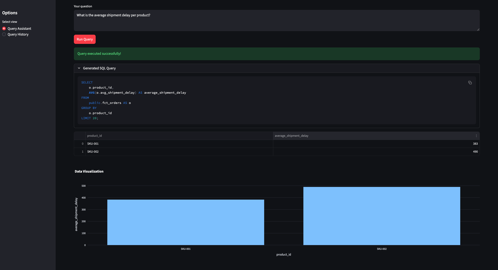
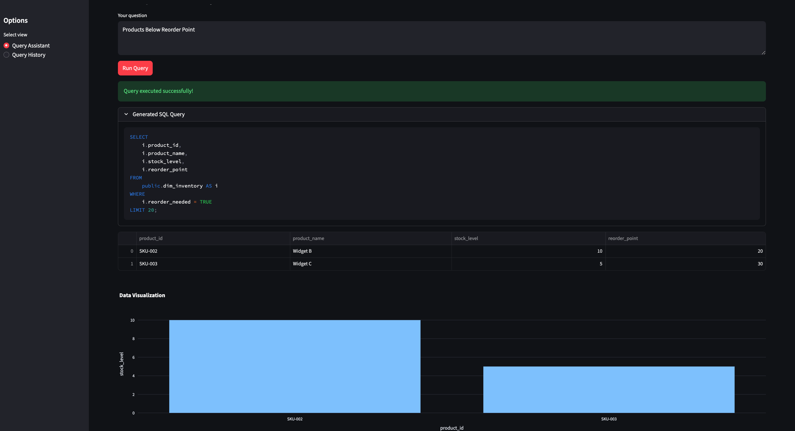

# 🧠 GenAI Data Insights Assistant

> A full-stack GenAI-powered analytics assistant — combining ETL (Airflow + dbt + Postgres) with a semantic layer (Chroma + LangChain) and an interactive Streamlit UI for text-to-SQL insights.

---


## 🚀 Overview
This prototype lets you ask questions such as:
> “Show total revenue by order month”  
> “Top 5 products by average shipment delay”

and automatically:
1. Retrieves schema context from Chroma (vector DB)  
2. Generates SQL using LangChain + OpenAI (or local Llama fallback)  
3. Executes queries on Postgres  
4. Displays results and charts in Streamlit  


## ✨ Key Features
- **Natural Language → SQL:** Ask business questions in plain English; get generated SQL + charts.
- **Semantic Understanding:** Uses a JSON semantic layer and vector embeddings for schema-aware reasoning.
- **Automated Data Lineage:** Each metric (e.g., `total_revenue`) is traced from raw CSV → ETL → dbt → semantic layer.
- **Data Quality Checks:** Great Expectations validates source and transformed datasets.
- **Self-updating Schema Context:** dbt manifest and semantic builder ensure metadata stays current.
- **Multi-agent Reasoning:** LangChain agents handle SQL generation, query validation, and chart recommendation.
- **Plug-and-play Stack:** One `docker-compose up` brings Airflow, dbt, Postgres, and Streamlit online.


## 🧠 Semantic Layer Design
- Defined in `semantic/semantic_layer.json`
- Merged automatically with dbt metadata into `merged_semantic.json`
- Used by LangChain agent to:
  - Retrieve entity/column context
  - Generate schema-aware SQL
  - Support cross-model joins (`fct_orders ↔ dim_inventory`)
  
**Entities:** `orders`, `inventory`, `shipments`  
**Metrics:** `total_revenue`, `orders_count`, `low_stock_count`  
**Dimensions:** `order_month`, `carrier`, `reorder_needed`


## 🧠 Example Questions You Can Ask
| Question | What Happens |
|-----------|---------------|
| “How many unique orders were placed per month?” | Generates SQL on `fct_orders`, groups by `order_month`, shows bar chart |
| “Which products need reordering?” | Queries `dim_inventory` for `reorder_needed = TRUE` |
| “What is the average shipment delay per product?” | Uses `avg_shipment_delay` from `fct_orders` |
| “Show total revenue by month” | Aggregates `SUM(total_revenue)` from `fct_orders` |
| “How many products are below reorder threshold?” | Uses semantic metric `low_stock_count` |


## 📈 Sample Insights

| Query | Result | Visualization |
|--------|---------|----------------|
| **What is the average shipment delay per product?** | `SKU-001, SKU-002`|  |
| **Products Below Reorder Point** | `Widget B, Widget C` |  |


---
## Tables
| Table           | Type      | Built By | Used For            | LLM Relevance                  |
| --------------- | --------- | -------- | ------------------- | ------------------------------ |
| `raw_orders`    | Raw       | Airflow  | Source data         | Foundation for sales metrics   |
| `raw_shipments` | Raw       | Airflow  | Logistics data      | Enables delivery KPIs          |
| `raw_inventory` | Raw       | Airflow  | Stock info          | Supports availability analysis |
| `stg_orders`    | Staging   | dbt      | Cleaned orders      | Used in facts                  |
| `stg_shipments` | Staging   | dbt      | Cleaned shipments   | Used in facts                  |
| `stg_inventory` | Staging   | dbt      | Cleaned inventory   | Used in dimensions             |
| `dim_inventory` | Dimension | dbt      | Contextual metadata | Used for joins & enrichment    |
| `fct_orders`    | Fact      | dbt      | Aggregated metrics  | Queried by LLM agent           |


## 🧩 Architecture
            ┌──────────────────────────────────────┐
            │           Streamlit UI               │
            │  (User Query + SQL + Visualization)  │
            └──────────────────────────────────────┘
                              │
                              ▼
             ┌────────────────────────────────┐
             │   LangChain Text-to-SQL Agent  │
             │  (Prompting + Validation + Run)│
             └────────────────────────────────┘
                              │
       ┌──────────────────────┼────────────────────────┐
       ▼                      ▼                        ▼
┌────────────┐        ┌─────────────┐          ┌────────────────┐
│  Postgres  │        │   ChromaDB  │          │   dbt Models   │
│  Warehouse │        │ Vector Store│          │  Semantic Layer│
└────────────┘        └─────────────┘          └────────────────┘
       ▲                                               │
       │                                               ▼
       └─────────────── Apache Airflow ────────────────┘
                  (ETL orchestration)


Data flow -> 

CSV Files (orders, shipments, inventory)
        │
        ▼
  Airflow DAG → Creates:
        ├── raw_orders
        ├── raw_shipments
        └── raw_inventory
        │
        ▼
  dbt transforms → Creates:
        ├── stg_orders
        ├── stg_shipments
        ├── stg_inventory
        │
        ├── dim_inventory
        └── fct_orders
        │
        ▼
  Semantic Layer + LangChain Agent
        └── LLM queries these models


## 🧰 Tech Stack
| Layer | Tool | Purpose |
|-------------------|---------------------------|----------|
| Language          | Python 3.11 + Poetry      | Dependency management |
| Data Warehouse    | PostgreSQL 15             | Raw + transformed data |
| Orchestration     | Apache Airflow 2.7        | ETL DAGs |
| Transformations   | dbt                       | SQL models & tests |
| Vector DB         | Chroma 1.1.1              | Semantic schema store |
| LLM Orchestration | LangChain + OpenAI GPT-4  | Text-to-SQL |
| UI                | Streamlit + Plotly        | Visualization |
| Data Quality      | Great Expectations        | Validation |
| Containerization  | Docker Compose            | Reproducible stack |


## ⚡ Quickstart
```bash
git clone https://github.com/gauraang01/genai-insights-assistant.git
cd genai-insights-assistant

cp .env.sample .env
# Edit .env → set POSTGRES_PASSWORD (and optionally OPENAI_API_KEY)

# Setup infra
docker compose up -d
poetry install


# Airflow
URL: http://localhost:8080
Login: admin / admin

Enable and trigger genai_data_etl_dag → loads sample CSVs into Postgres.

# Dbt
export DBT_PROFILES_DIR=./dbt
poetry run dbt compile     # Build manifest.json for semantic layer
poetry run dbt run         # Create tables/views in Postgres


# Semantic layer
poetry run python semantic/semantic_builder.py  # Build merged_semantic.json
poetry run python semantic/build_semantic_index.py # indexes in vector database

# Run sanity tests
poetry run pytest -v

# Run agent
poetry run python -m agent.text_to_sql_agent

# Run streamlit UI from docker:
http://localhost:8501/

